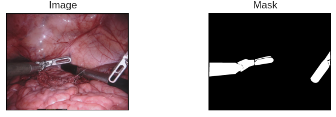

# Medical Tools Segmentation 

- Precise segmentation of medical instruments and tools plays a crucial role in assisting healthcare professionals during surgical procedures. 
- The project focuses on leveraging deep learning techniques to accurately segment medical tools from image.

### Dataset: [Binary Segmentation endovis Dataset](https://www.kaggle.com/datasets/aithammadiabdellatif/binarysegmentation-endovis-17)
A specialized collection of annotated endoscopic images. These data samples have been meticulously labeled, highlighting the regions of interest corresponding to medical tools. 

### Architecture: [unetplusplus](https://github.com/qubvel/segmentation_models.pytorch/tree/master)
Unetplusplus is an advanced extension of the widely used U-Net architecture, specifically designed for semantic segmentation tasks. It combines the strengths of U-Net with innovative features like dense skip connections and improved feature extraction pathways.
